# Fitness App: BMI calculate

A Flutter-based fitness app that provides guidance on **Muscle Exercises** and **Yoga Asanas** with visually appealing UI and categorized workout sections.

## Features
- **Calculate BMI Section**: Calculate your BMI : set Male-Female, Height , Weight,Age.
- **Result Section**: Displays your BMI result.
- **Muscle Exercise Section**: Displays different muscle workouts with illustrations.
- **Yoga Asana Section**: Guides users through various yoga poses with animated illustrations.
- **Simple and Clean UI**: Uses a green theme for a healthy and refreshing look.
- **Categorized Workouts**: Separate sections for muscle training and yoga.

## Screenshots
<p align="center" style="background-color: #f0f0f0; padding: 10px;">
   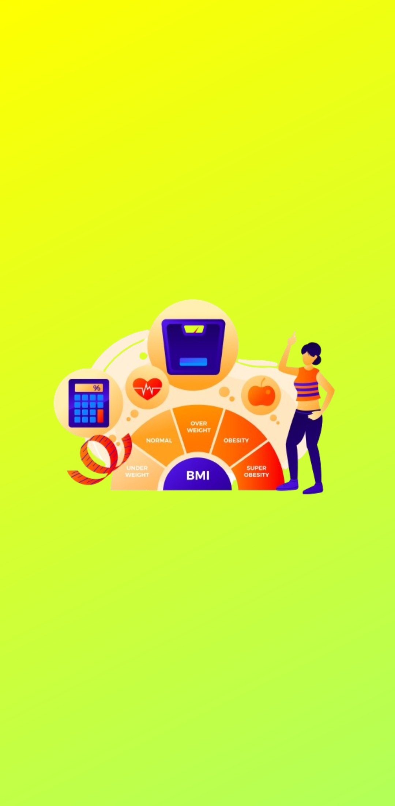
  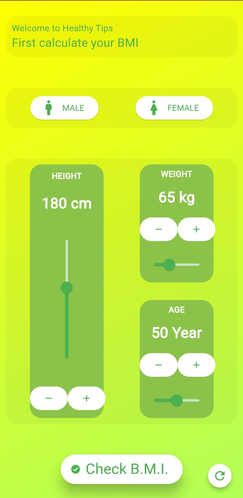
  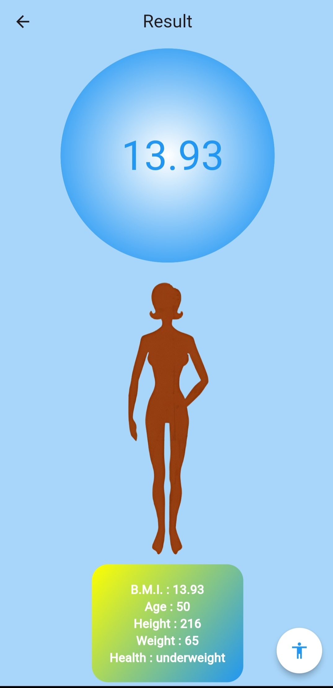
  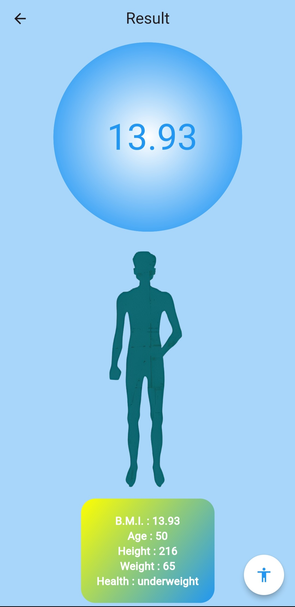
  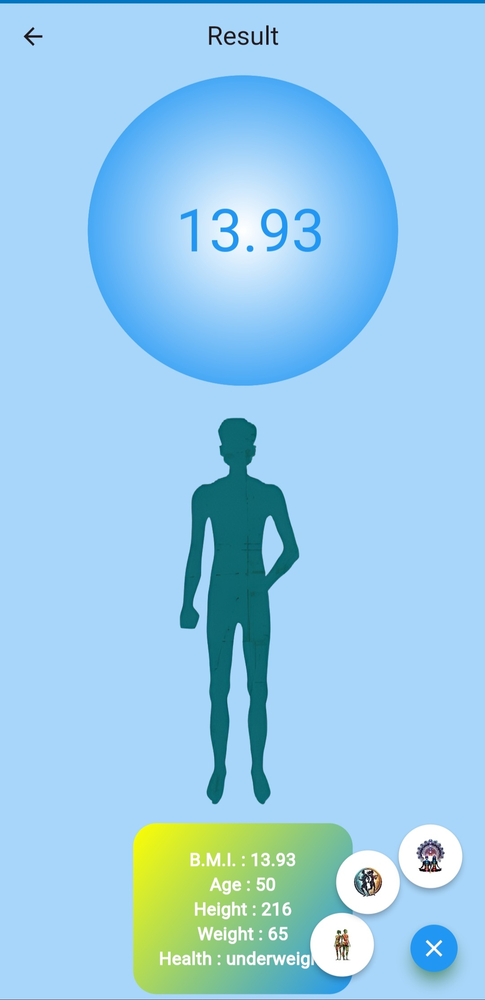
</p>

### Food Recomend Section 
<table>
  <tr>
    <td style="background-color: #f0f0f0; padding: 10px;">
      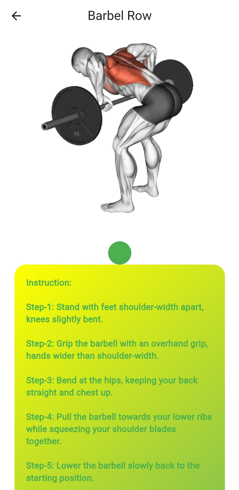
      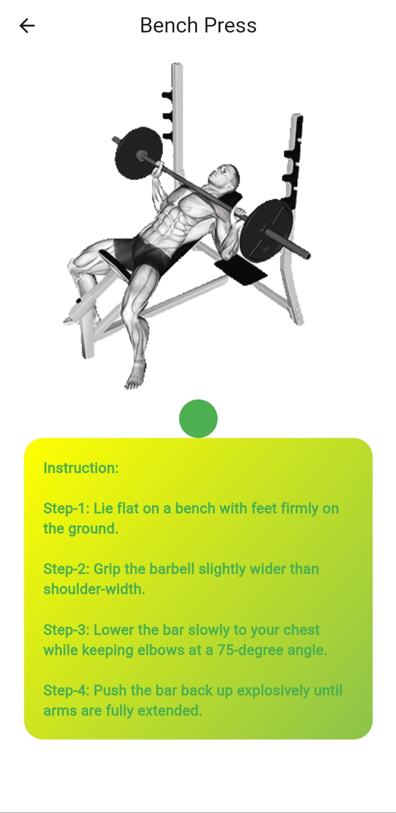
      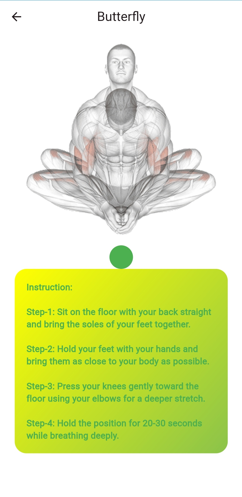
      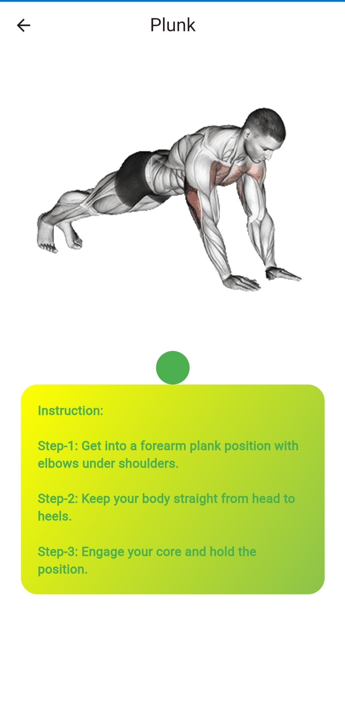
      
    </td>
  </tr>
</table>

### Muscle Exercise Section
<p align="center" style="background-color: #f0f0f0; padding: 10px;">
   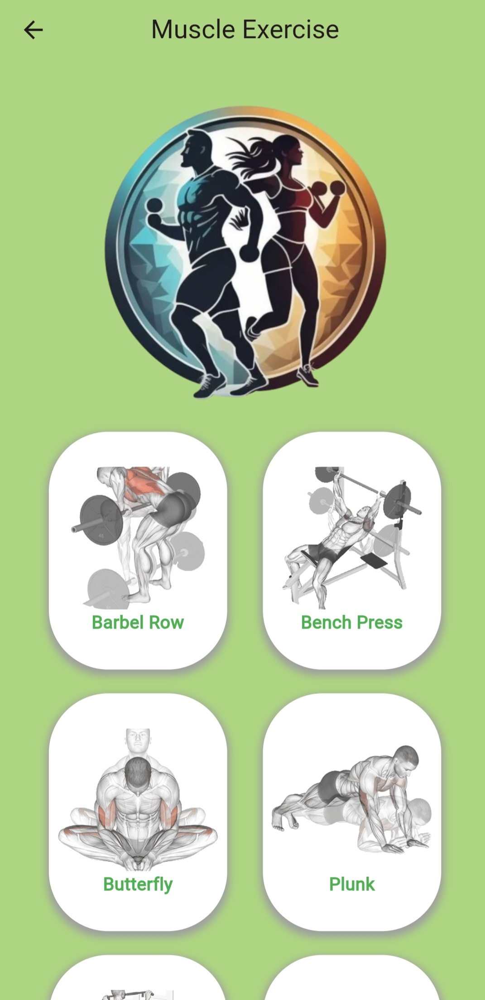
  
  
  
  
</p>


### Yoga Asana Section
<p align="center" style="background-color: #f0f0f0; padding: 10px;">
   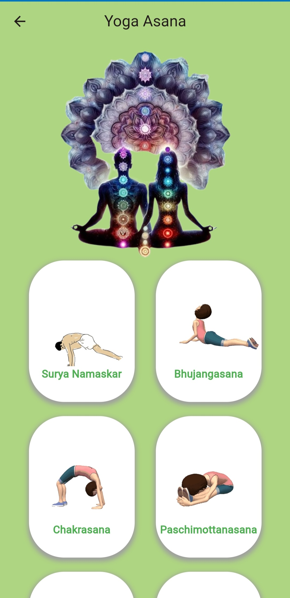
  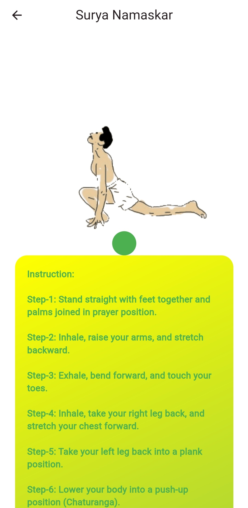
  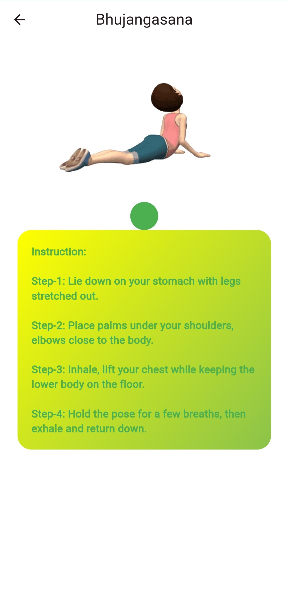
  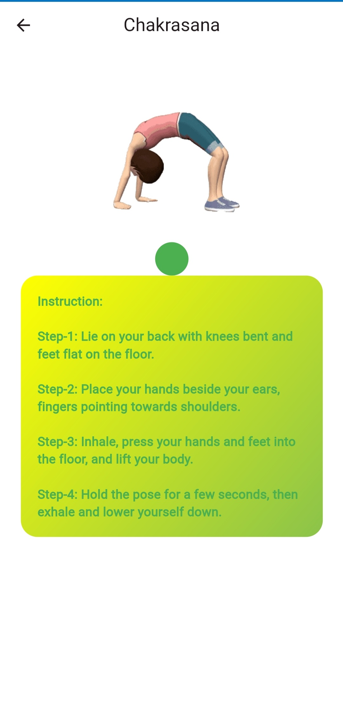
  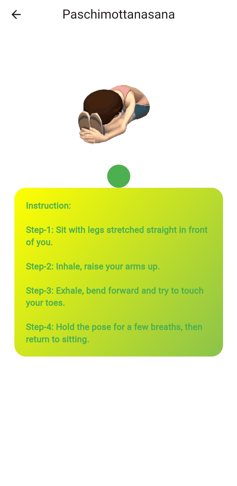
</p>

_(Replace the above placeholders with actual screenshot file names)_

## Installation
Run this app : Visit This Link
   ```bash
    https://mrloknath.github.io/BMI/
   ```


## Future Enhancements
- **Add More Workout Categories** (e.g., Cardio, Meditation)
- **Dark Mode Support**
- **Video Demonstrations for Exercises**
- **User Progress Tracking**

## Contributing
Feel free to contribute to this project! Fork the repository and submit a pull request with your changes.


---
Developed with ❤️ using Flutter.
